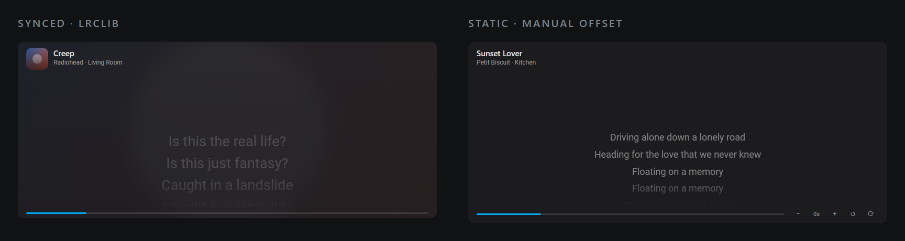

# Lyrics Card for Home Assistant

A single-file Lovelace card that shows lyrics for whatever is playing on any
`media_player`, synced to playback. No custom integration, no dependencies, no
API key.

```
raw 46.4 KB   ·   gzip 13.8 KB
```



## Features

- **Any source.** Looks up `media_title` + `media_artist` + `media_album` on
  [LRCLIB](https://lrclib.net), a free, no-auth, CORS-open lyrics database.
  Falls back to `/api/search` when the exact match misses, so slightly wrong
  metadata (missing album, `feat.` suffixes, live versions) still resolves.
- **Synced when available.** Parses LRC timestamps and highlights the current
  line, scrolling it to centre.
- **Static when not.** If the best match has plain lyrics but no timestamps, it
  looks for a *different release of the same song* that does have them, matches
  the text line by line, and transfers the timings across. If that fails it
  paces the lines at a readable rate.
- **No duplicate lyrics.** Two devices playing the same track are grouped into
  one entry. The header shows `Living Room +1` to tell you it's shared.
- **Swipe when tracks differ.** Different tracks become dots in the header.
  Swipe the lyrics horizontally, tap the dots, or tap the card to cycle.
- **Instant.** No polling. It reads state HA already streams over the existing
  websocket and interpolates the play position with a local clock, so the
  highlight is smooth at 5 Hz without a single extra API call.
- **Cached.** Lyrics are stored in `localStorage` per browser (up to 500 tracks,
  180 days). "No lyrics found" is remembered for a day, so a missing track is
  never re-fetched.
- **Album art and blurred backdrop.** If the player reports a picture, it becomes
  the card's background, blurred and dimmed behind a veil so the lyrics stay
  readable. Turn it off with `show_album_art: false`.
- **Make it yours.** Card height, font size, line height, alignment, colours,
  art size, blur strength and dimming are all configurable — see [Options](#options).

## Installation (HACS)

1. Install [HACS](https://hacs.xyz/) if you haven't already.
2. Push this repository to GitHub as **`ha-lyrics-card`**. HACS matches the
   dashboard file to the repository name, and `hacs.json` pins it explicitly via
   `filename`, so the file name must stay `ha-lyrics-card.js`.
3. HACS → **Dashboard** → ⋮ → **Custom repositories** → add
   `https://github.com/Kedharnadh/ha-lyrics-card` with category **Dashboard**.
4. Search HACS for **Lyrics Card** → **Download**.
5. **Settings → Dashboards → Resources** and add, if HACS didn't already:

   | | |
   | --- | --- |
   | URL | `/hacsfiles/ha-lyrics-card/ha-lyrics-card.js` |
   | Type | **JavaScript module** |

6. Reload Lovelace (`Ctrl` + `F5` / hard refresh).

## Usage

```yaml
type: custom:ha-lyrics-card
```

It picks up every playing `media_player` automatically. You can also add it from
the card picker by searching for **Lyrics Card**.

### Options

| Option | Default | Description |
| --- | --- | --- |
| `entities` | all `media_player`s | Restrict to specific players |
| `max_lines` | `7` | Visible line height, in lines |
| `font_size` | `28` | Lyric font size in px |
| `line_height` | `38` | Line box height in px — raise this if lines wrap |
| `height` | auto | Card height in px (60–1600). Overrides `max_lines` |
| `align` | `center` | Lyric alignment: `left`, `center` or `right` |
| `smooth` | `true` | Smooth scroll to the active line |
| `show_progress` | `true` | Thin progress bar under the lyrics |
| `show_header` | `true` | Show the track header |
| `show_friendly_name` | `true` | Prefix the header with the player name |
| `show_album_art` | `true` | Show album art and the blurred backdrop |
| `art_size` | `42` | Album art size in px (0–200) |
| `background_blur` | `18` | Backdrop blur in px (0–80) |
| `background_dim` | `0.34` | How strongly the art shows through (0–1) |
| `background_veil` | `0.62` | Card-coloured wash over the art (0–1) |
| `text_color` | theme | Lyric colour as `#rgb` or `#rrggbb` |
| `highlight_color` | theme | Active-lyric colour as `#rgb` or `#rrggbb` |
| `lyrics_source` | `lrclib` | `lrclib`, or `music_assistant` to try MA first |
| `music_assistant_url` | — | MA server, e.g. `http://ma.local:8095` |
| `music_assistant_token` | — | MA long-lived access token |
| `music_assistant_timeout` | `8` | Seconds to wait for MA before falling back (2–30) |
| `static_scroll` | `true` | Drift unsynced lyrics up slowly instead of faking a highlight |
| `static_font_size` | `18` | Font size for unsynced lyrics in px (10–48) |
| `static_scroll_speed` | `14` | Drift speed in px per second (4–60) |

`height` defaults to `max_lines × line_height`, so you normally only need it when
you want a fixed card height. Out-of-range numbers are clamped rather than
rejected, and an unparseable colour falls back to your theme.

Album art is read from whichever of `entity_picture`, `media_image_url`,
`media_image`, `media_picture` or `media_artwork` the player provides. Only
`http(s)` and root-relative URLs are used, so a hostile entity can't smuggle a
`javascript:` or `data:` URL into the card.

### Unsynced lyrics

Plenty of tracks have plain lyrics with no timings. Highlighting one line at a
time would mean inventing them, so instead the whole lyric block is set in one
smaller font (`static_font_size`) and drifts slowly upward at
`static_scroll_speed` px per second, rests on the last line, then loops. It
keeps drifting whatever the playback state — a paused track is usually just
paused, not finished.

- Scrolling by hand parks it for a few seconds so you can actually read a line.
- `prefers-reduced-motion` is honoured: no drift, the block sits centred and you
  scroll it yourself.
- Synced lyrics are untouched — they keep the large active line and scroll to it.
- The `−`/`+` nudge still works. It shifts the estimate of which line is "now",
  which matters when the timings were borrowed from a different release of the
  same song.

Set `static_scroll: false` to get the old behaviour back: estimated timings with
a large centred highlight.

```yaml
type: custom:ha-lyrics-card
entities:
  - media_player.spotify
  - media_player.living_room_tv
max_lines: 5
font_size: 32
line_height: 44
```

### A themed, left-aligned card

```yaml
type: custom:ha-lyrics-card
height: 320
align: left
font_size: 30
text_color: "#f2e9dc"
highlight_color: "#ffb703"
art_size: 56
background_blur: 26
background_dim: 0.45
background_veil: 0.55
show_friendly_name: false
```

If the blurred artwork ever fights with the lyrics, raise `background_veil`
towards `1` (or drop `background_dim` to `0`) to push it further back.

## Lyrics from Music Assistant (optional)

Music Assistant resolves its own synced lyrics and will ask the track's own
provider first (Bandcamp, OpenSubsonic/Navidrome, and others) before falling back
to LRCLIB or Genius. Point the card at it and MA is tried before LRCLIB:

```yaml
type: custom:ha-lyrics-card
lyrics_source: music_assistant
music_assistant_url: http://ma.local:8095
music_assistant_token: !secret ma_lyrics_token
```

To get a token: in Music Assistant go to **Settings → Users → your user → Access
tokens → Add token**. It needs the *Library read* scope. Use the user token, not
the Home Assistant system token — MA rejects the latter on its normal web server.

Everything degrades to LRCLIB automatically, so this is safe to leave on: if MA
is unreachable, the token is wrong, the track is not a Music Assistant item, or
MA has no lyrics, the card falls back to LRCLIB for that track. MA and LRCLIB
results are cached separately, so enabling it never discards lyrics you already
had.

**Please read this before enabling it.** Home Assistant exposes nothing useful
here, which is why the card talks to MA directly:

- The MA `media_player` entity has no lyrics attribute, and the
  `music_assistant` integration registers no websocket commands.
- The `music_assistant.get_queue` action exists, but its response deliberately
  omits lyrics.

So the card speaks MA's own websocket API (`metadata/get_track_lyrics`) directly.
That is an internal MA command with no Home Assistant integration surface and no
deprecation path — it could change in a future MA release. It is opt-in for that
reason, and the LRCLIB path remains the default.

Also worth knowing:

- Only tracks that are actual Music Assistant items work, identified from the
  `provider://media_type/item_id` URI HA puts in `media_content_id`. A plain
  stream URL or a non-MA player just uses LRCLIB.
- Spotify and YouTube Music do **not** supply lyrics to Music Assistant, so
  tracks from those services still resolve through MA's fallback providers —
  which usually means the same LRCLIB data the card would have fetched anyway.
  The extra coverage MA adds is mainly Genius and self-hosted OpenSubsonic.
- Your MA server must be reachable from the browser, and `wss://` is used
  automatically when the URL is `https://`.

## Manual installation

Copy `ha-lyrics-card.js` into `config/www/`, add
`/local/ha-lyrics-card.js` as a **JavaScript module** resource, then use
`type: custom:ha-lyrics-card`.

## Nudging static lyrics

When timings are estimated rather than real, a small control row appears at the
bottom right: `−  +0s  +  ↺  ⟳`.

- `−` / `+` shift the lyrics by a second. Hold to repeat, or scroll over the
  number. Adjustments are remembered per track.
- `↺` resets the shift.
- `⟳` clears the cache and re-fetches, in case lyrics were added upstream.

## Development / CI

- `.github/workflows/hacs.yaml` runs [HACS validation](https://github.com/hacs/action)
  plus the test suite on every push and pull request.
- `.github/workflows/release.yaml` turns a tag (`v1.1.0`) into a GitHub Release.
  HACS tracks the default branch for updates, so tagging is only needed if you
  want a release page.
- Tests are plain Node scripts, no dependencies:

  ```
  node tests/test-logic.js      # LRC parsing, gap filling, timing transfer
  node tests/test-card.js       # grouping, dedupe, swipe, line sync, options
  node tests/test-degenerate.js # empty/degenerate hass, HA preview behaviour
  node tests/test-live.js       # end-to-end against the real LRCLIB API
  ```

  `tests/dom-shim.js` is the shared miniature DOM used by the two card suites.

## Notes

- Syncing depends on the media player reporting `media_position`. Players that
  only update it on track change still work, because the card extrapolates from
  its own clock and re-anchors whenever HA's value moves.
- Purely client-side, so lyrics are fetched from the browser's IP rather than
  your server's.
- Lyrics come from LRCLIB, a community-run database. Coverage is good for
  mainstream music and thin for library music or regional releases.

## Credits

Lyrics data provided by [LRCLIB](https://lrclib.net). This project is not
affiliated with LRCLIB or Home Assistant.

## License

MIT — see [LICENSE](LICENSE).
